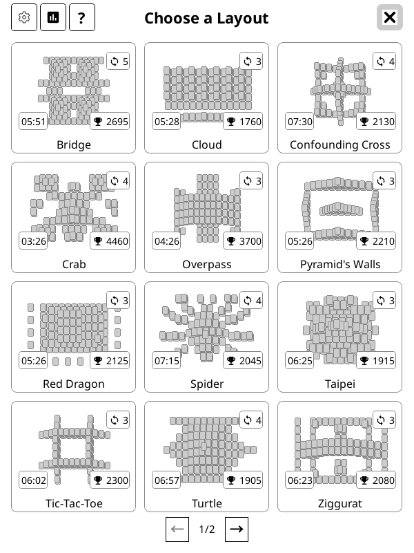
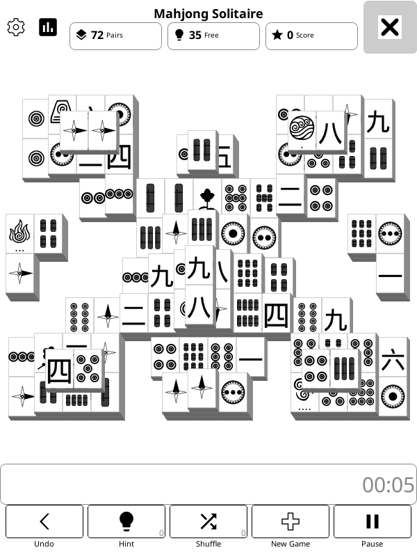
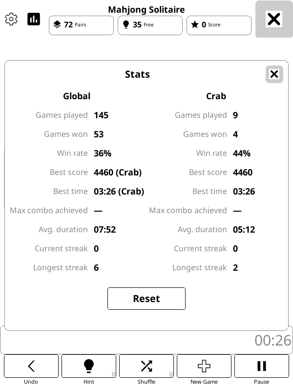

# Mahjong Solitaire for KOReader

Mahjong Solitaire (also known as Shanghai) as a native [KOReader](https://koreader.rocks/)
plugin for jailbroken e-ink readers. It is designed for the small, grayscale screens of older
Kindles, including the Kindle Touch, while also adapting to larger KOReader screens.

The game is single-player: remove matching pairs of free tiles until the 144-tile board is
empty. It includes 24 different 3D layouts, local e-ink-friendly redraws, persistent games and
settings, scoring, hints, undo, shuffle and per-layout aswell as global statistics.

## Screenshots

<p align="center">
  
  
  
</p>

## Feature Overview

- 24 layouts, selected from a paged layout picker
- A stepped 3D board with portrait tile faces and outward bevels
- Classic free-tile rules, including cross-matching flowers and seasons
- Undo, hints, manual shuffle, dead-board detection, and recovery shuffles
- Score chains, fast-clear combo bonuses, and hint/shuffle penalties
- Pause, elapsed timer, save-and-resume, and corrupt-save protection
- Long-press Hint to auto-solve a board when you want to watch it finish (Invalidates score for the current game)
- Win summaries, lifetime statistics, per-layout wins, best scores, and best times
- Bundled English and German UI translations, with automatic German selection for German KOReader locales
- Layout and board sizing that adapt to the reader's screen (untested)

## Requirements

- A jailbroken Kindle or another device supported by KOReader.
- KOReader installed and working on the device.
- A way to copy files to the device, such as USB mass storage or SSH.

This is a KOReader plugin, not a Kindle-native application. It does not run from the standard
Kindle home screen and it does not require Amazon's Kindle UI to be modified beyond installing
KOReader and its plugins.

## Quick Install

### Install a release

1. Open the project's [latest release](https://github.com/Quad-Plex/komahjong-solitaire/releases/latest).
2. Download the `mahjong.koplugin-vX.Y.zip` asset from the release.
3. Unzip it directly into KOReader's `plugins/` directory. The archive already contains the
   complete `mahjong.koplugin/` directory.
4. Fully restart KOReader. Plugins are loaded at startup.
5. Open **Tools -> Mahjong Solitaire**.

## How to Play

1. Open **Tools -> Mahjong Solitaire** in KOReader.
2. Choose a layout from the picker. Selecting a card starts a new game.
3. Tap a free tile, then tap a matching free tile to remove the pair.
4. Clear all 144 tiles to win.

A tile is free when no tile overlaps it from above and at least one horizontal side is open.
Tap a selected tile again to deselect it. Tapping empty board space clears the selection by
default; this can be changed in Settings.

Flowers match any other flower, and seasons match any other season. Other tiles must match the
same face. There are no computer opponents.

## Layouts

The picker currently includes these 24 layouts:

| --- | --- |
| Bridge | Hare |
| Cloud | Horse |
| Confounding Cross | Tiger |
| Crab | Ram |
| Overpass | Monkey |
| Pyramid's Walls | Rooster |
| Red Dragon | Dog |
| Spider | Snake |
| Taipei | Boar |
| Tic-Tac-Toe | Ox |
| Turtle | Wedges |
| Ziggurat | Hourglass |

The first twelve layouts are transcriptions of GNOME Mahjongg maps. The compact multi-layer
layouts are based on PySolFC layouts. Every layout contains the standard 144 tiles, but the
shape, number of layers, and difficulty vary.

The full-screen picker uses fixed three-column by four-row pages. Each card includes a schematic
thumbnail, human win count, and, when available, per-layout best score and fastest time.

## Scoring

- Each pair is worth 10 points.
- A same-group chain awards a 50-point bonus. Groups include suits, winds, dragons, flowers,
  and seasons.
- Fast consecutive clears award escalating combo bonuses.
- Showing a hint costs 5 points once per hint session.
- A user-initiated shuffle costs 10 points.
- Penalties can reduce the score below zero and are not refunded by Undo.
- Automatic recovery shuffles and auto-solve do not charge shuffle penalties.
- Time does not add a score bonus.

The win summary reports the current result alongside overall and per-layout records. Auto-solved
wins are not recorded as human high scores or lifetime wins.

## Game Controls

- **Undo:** restore the most recently removed pair, including its board position and pair score.
- **Hint:** highlight an available matching pair. Repeated hints in the same session do not keep
  charging the hint penalty.
- **Shuffle:** manually rearrange the remaining tiles after confirmation.
- **Pause:** freeze the clock behind a tap-consuming pause overlay.
- **New Game:** open the layout picker and choose the next layout.
- **Auto-solve:** hold the Hint button for about 10 seconds. Once started, the solver runs to
  completion and ignores normal game input.

When no matching free pair remains, the plugin evaluates candidate shuffles and chooses one with
the most available moves. Provably dead boards show a recovery dialog instead of retrying
forever. A saved auto-solve game resumes the solver after restart.

## Saving and Statistics

The plugin stores its game state, settings, and lifetime statistics in KOReader's settings
directory, in `mahjong.lua`. A running game is saved when KOReader closes the plugin. Won boards
are not saved, so starting Mahjong after a completed game opens the layout picker.

Saved games include the selected layout, remaining tiles, score, undo history, hint/shuffle
counters, and auto-solve state. Invalid or incompatible saves are discarded and replaced with a
fresh game rather than preventing the plugin from launching.

The Statistics screen includes games played and won, timing records, streaks, overall records,
and per-layout records. Resetting statistics requires confirmation.

## Settings and Localization

The Settings panel includes:

- The available interface languages. English and German are bundled; German is selected
  automatically on first launch for German KOReader locales.
- Whether an empty-board tap clears the current selection.
- Timer display mode: periodic interval or on interaction.
- Timer update interval when interval mode is selected.

The timer always measures elapsed time while a game is running. The display mode only controls
how often the visible `mm:ss` value is repainted.

### Adding a Translation

Translations are plugin-local and are discovered automatically from
`mahjong.koplugin/translations/`. To contribute another language:

1. Copy `mahjong.koplugin/translations/en.lua` to
   `mahjong.koplugin/translations/<code>.lua`, using a lowercase language code such as `fr`.
2. Keep the file's `code`, set its native display `name`, and add the relevant KOReader locale
   prefixes to `locales`.
3. Translate every entry in the `strings` table. Keep the existing keys and `%d` / `%s`
   placeholders unchanged.
4. Add the file to the repository. No loader, settings, or language-list code needs to change.
5. Run `tests/run.sh`, then install the complete `mahjong.koplugin/` directory and restart
   KOReader. The new language will appear automatically in Mahjong's Settings.

Language files are plain Lua definitions. For example:

```lua
return {
    code = "fr",
    name = "Français",
    locales = { "fr" },
    strings = {
        ["toolbar.hint"] = "Indice",
        -- ... all other catalog keys ...
    },
}
```

If a translation is missing a key, the English string is used as a fallback. Please include
complete coverage in contributions so the UI remains consistently translated.

## E-Ink Design

The board is rendered as a 3D stack rather than a flat grid. Upper layers shift up and left by
one bevel thickness, allowing the right and bottom bevels to form clean steps onto the tiles
beneath them. Tile faces and bevel segments are rendered independently.

After a pair is removed, only the changed face, bevel, and affected local edges are refreshed.
Terminal dialogs wait for structural board repaint work to settle. These details reduce large
screen flashes and help avoid stale pixels on e-ink displays.

## Development

The plugin deliverable is `mahjong.koplugin/`. Game rules, layouts, scoring, persistence
serialization, and statistics are kept in pure Lua modules so they can be tested without
KOReader.

Run the repository's checks with:

```bash
tests/run.sh
```

This runs Lua syntax checks, `luacheck`, pure-module self-tests, and the feature-driven headless
test suites. Icon assets are generated rather than hand-edited:

```bash
python3 tools/gen_icons.py
python3 tools/gen_icons.py --check
python3 tools/check_icons.py
python3 tools/preview.py
```

The icon QA and preview tools require `lua` and `rsvg-convert` on `PATH`.

Repository documentation for plugin architecture and KOReader-specific constraints is in
`AGENTS.md`. The implementation history and design decisions are in
[`development/IMPLEMENTATION_PLAN.md`](development/IMPLEMENTATION_PLAN.md) and
[`development/implementation-plan/`](development/implementation-plan/).

## License

GNU General Public License v3.0 or later.
